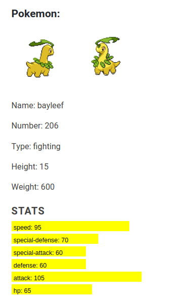

# wp-dexter

wp-dexter is the WordPress version of the pokémon encyclopedia, ready to be displayed on your wordpress website. Gotta catch'em all!

**Contributors:** [oscarssanchez](https://profiles.wordpress.org/oscarssanchez)  
**Tested up to:** 4.9.1  
**Tags:** [widget](https://wordpress.org/plugins/tags/widget)  
**License:** [GPLv2 or later](http://www.gnu.org/licenses/gpl-2.0.html)  
**Requires PHP:** 5.4 

# Description 

wp-dexter is the widget version for WordPress of the handy pokémon encyclopedia.
It makes use of the pokéAPI(http://pokeapi.com).

wp-dexter can be configured to display custom data like: show height, weight or pokémon type.
Dexter also displays pokemon stats graphically. It can be configured to display only pokemón from specific generations.

# Screenshots

  

# Installation

* Upload the folder to your /wp-content/plugins/ directory  
* Activate the plugin through the 'Plugins' menu in WordPress

## Changelog ##

### 1.0.1 ###

* Now Dexter displays pokemón stats with the help of D3
* Pokemon list rendering is now part of a function, which makes easier to maintain the plugin as pokemón gens are added.

### 1.0 ###  

* First version
